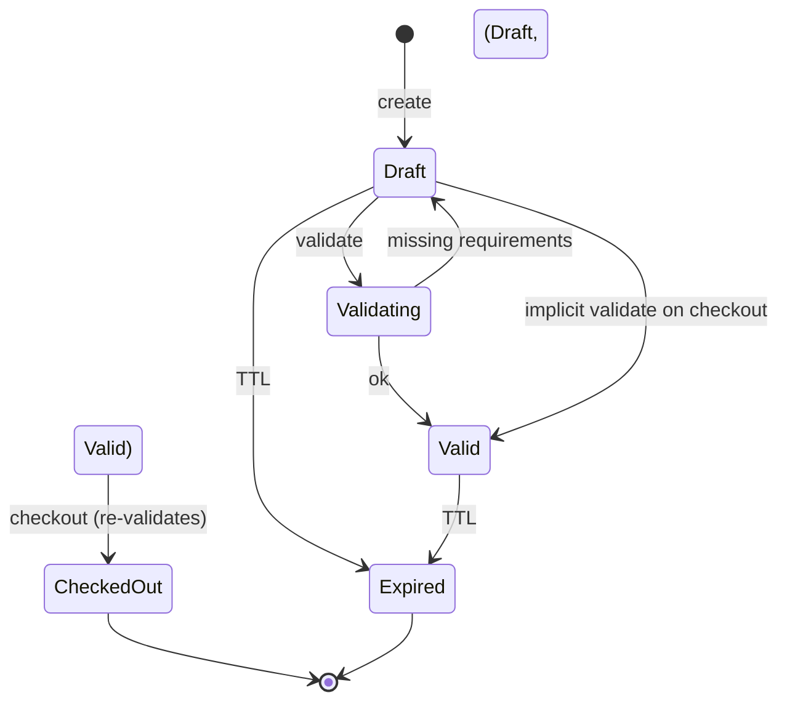
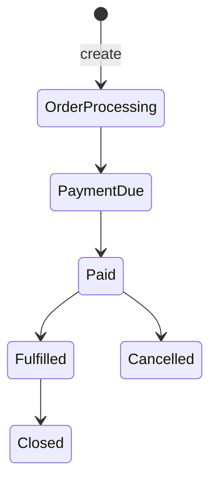

# Circles.Market.Cart -- Spec v1.0

## 0) Purpose & scope

A small service that:

1. creates/manages **baskets** (ephemeral, mutable),
2. **validates** them and returns precise missing slots, and
3. **exchanges** a valid basket for an immutable **Order** identified by a public `orderId` (e.g., `ord_...`). Reads require JWT-based ownership checks.

**Out of scope:** payment execution & indexing, inventory reservation.

---

## 1) Entities & JSON-LD

### 1.1 Basket (custom type)

* `@context`: `https://schema.org/` + `https://aboutcircles.com/contexts/circles-market/`
* `@type`: **`circles:Basket`**
* Identity: `basketId` (opaque, e.g. UUIDv7 string)
* Ownership: `buyer` (lowercase `0x...`), `operator` (lowercase `0x...`), `chainId` (int)
* Status: `Draft | Validating | Valid | CheckedOut | Expired`
* TTL: `ttlSeconds` (default 24h; extend on write)

```json
{
  "@context": [
    "https://schema.org/",
    "https://aboutcircles.com/contexts/circles-market/"
  ],
  "@type": "circles:Basket",
  "basketId": "bkt_01JC...",
  "buyer": "0x<buyer>",
  "operator": "0x<operator>",
  "chainId": 100,
  "status": "Draft",
  "items": [ /* OrderItemPreview (below) */ ],
  "shippingAddress": { "@type": "PostalAddress" },
  "billingAddress": { "@type": "PostalAddress" },
  "ageProof": { "@type": "Person" },
  "contactPoint": { "@type": "ContactPoint" },
  "createdAt": 1728000000,
  "modifiedAt": 1728000123,
  "ttlSeconds": 86400
}
```

#### 1.1.1 OrderItemPreview (basket line)

Use schema.org **`OrderItem`** semantics *even before* order creation:

```json
{
  "@type": "OrderItem",
  "orderQuantity": 2,
  "orderedItem": { "@type": "Product", "sku": "tee-black" },
  "seller": "0x<seller>",                               // convenience (also present in offer)
  "imageUrl": "https://cdn.example.com/img/tee-black.jpg",
  "productCid": "Qm...",                                // provenance (optional but recommended)
  "offerSnapshot": {
    "@type": "Offer",
    "price": 19.0,
    "priceCurrency": "EUR",
    "seller": { "@type": "Organization", "@id": "eip155:100:0x<seller>" }
  }
}
```

* `orderQuantity`/`orderedItem` match schema.org. ([Schema.org][2])
* Monetary fields live on `Offer` (or later on a PriceSpecification), not on the basket itself. ([Schema.org][3])
* `imageUrl` is an optional convenience for UI previews, mapped to `schema:image` in the market context.
* Do NOT include secrets or tokens in any URL templates. Use public `paymentReference` if you need to build a checkout path.

Note on offerSnapshot:

* `offerSnapshot` is server-managed. Clients MAY omit it in requests. Any client-supplied `offerSnapshot` is ignored and overwritten by the cart service using canonical Product/Offer data from Circles Profiles.

Inventory-aware quantity limits:

* For each `(chainId, seller, sku)` where the Product’s current `Offer.inventoryFeed` resolves successfully to a `QuantitativeValue`, the service enforces:

```
sum(orderQuantity for all items in basket with same (chainId, seller, sku))
<= QuantitativeValue.value
```

* Violations yield HTTP 422 with a human-readable error message.

> **Why not schema.org ShoppingCart?** It doesn't exist in core; using a custom `circles:Basket` avoids pretending it does. (Google hosts a `Cart` extension, but that's not core schema.org.) ([schema.googleapis.com][4])

---

### 1.2 ValidationResult (API output)

Precise, slot-level results to disambiguate multiple fields of the same type.

```json
{
  "@context": "https://schema.org/",
  "@type": "Thing",
  "basketId": "bkt_...",
  "valid": false,
  "requirements": [
    {
      "id": "req:shipping-address",
      "ruleId": "rule:shipping-address",
      "reason": "Physical item present",
      "slot": "shippingAddress",
      "path": "/shippingAddress",
      "expectedTypes": ["https://schema.org/PostalAddress"],
      "cardinality": { "min": 1, "max": 1 },
      "status": "missing",   // "ok" | "missing" | "typeMismatch" | "invalidShape"
      "scope": "basket",     // NEW (optional; when absent, treat as basket-scoped)
      "itemIndexes": null,    // NEW (optional; when present, refer to basket.items[*])
      "blocking": true        // OPTIONAL: reserve for non-blocking recommendations
    },
    {
      "id": "req:billing-address",
      "ruleId": "rule:invoice",
      "reason": "Invoice requires billing address",
      "slot": "billingAddress",
      "path": "/billingAddress",
      "expectedTypes": ["https://schema.org/PostalAddress"],
      "cardinality": { "min": 1, "max": 1 },
      "status": "ok",
      "foundAt": "/billingAddress",
      "foundType": "https://schema.org/PostalAddress",
      "scope": "basket",
      "itemIndexes": null,
      "blocking": true
    }
  ],
  "missing": [
    { "slot": "shippingAddress", "path": "/shippingAddress", "expectedTypes": ["https://schema.org/PostalAddress"] }
  ],
  "ruleTrace": [
    { "id": "rule:shipping-address", "evaluated": true, "result": "missing" },
    { "id": "rule:invoice", "evaluated": true, "result": "ok" }
  ]
}
```

* Use **JSON Pointer** (`path`) to pinpoint the exact missing node.
* `expectedTypes` are JSON-LD class IRIs (schema.org wherever useful).
* For arrays, `path` points to the element (e.g., `/addresses/1`).
* Keep a summary `missing[ ]` for quick UIs; drive logic off `requirements[ ]`.

Additional notes on new fields:

* `scope` is optional; when absent, treat the requirement as basket-scoped. Current server rules set `scope = "basket"` for basket-level requirements and `scope = "item"` for per-line ones like quantity.
* `itemIndexes` is optional; when present, indexes refer to `basket.items[*]` (0-based).
* `blocking` is optional and defaults to `true`. Today all rules are blocking; future non-blocking recommendations may set this to `false`.

---

### 1.3 Order (immutable snapshot)

* `@type`: **`Order`** (schema.org)
* Use **`acceptedOffer`** (Offer snapshots) and **`orderedItem`** (OrderItem lines).
* Multi-seller orders: prefer seller on **each `Offer`**; `Order.seller` (singular) is optional. The **marketplace/operator** should be in `broker`. ([Schema.org][1])
* Totals/amounts: use **`totalPaymentDue: PriceSpecification`** (with `price`/`priceCurrency`). ([Schema.org][3])

```json
{
  "@context": "https://schema.org/",
  "@type": "Order",
  "orderNumber": "ord_01JC...",
  "orderStatus": "https://schema.org/OrderProcessing",
  "customer": { "@type": "Person", "@id": "eip155:100:0x<buyer>" },
  "broker":   { "@type": "Organization", "@id": "eip155:100:0x<operator>" },
  "acceptedOffer": [
    {
      "@type": "Offer",
      "price": 19.0, "priceCurrency": "EUR",
      "seller": { "@type": "Organization", "@id": "eip155:100:0x<seller>" }
    }
  ],
  "orderedItem": [
    {
      "@type": "OrderItem",
      "orderQuantity": 2,
      "orderedItem": { "@type": "Product", "sku": "tee-black" },
      "productCid": "Qm..."
    }
  ],
  "billingAddress": { "@type": "PostalAddress" },
  "shippingAddress": { "@type": "PostalAddress" },
  "totalPaymentDue": { "@type": "PriceSpecification", "price": 38.0, "priceCurrency": "EUR" },
  "paymentUrl": "https://pay.example/tx/..."
}
```

Notes:

* `Order.seller` exists, but for marketplaces it's cleaner to set `broker` (marketplace) + line-level `Offer.seller`. `merchant` is deprecated in favor of `seller`. ([Schema.org][1])

---

## 2) State machines

### 2.1 Basket



### 2.2 Order (downstream)



---

## 3) API

Base: `/api/cart/v1` (JSON-LD; `application/ld+json; charset=utf-8`).
Security headers: `X-Content-Type-Options: nosniff`.
Addresses must pass your `Utils.NormalizeAddr` rules (lowercase `0x...`).

### 3.1 Create basket

`POST /baskets`
Body: optional `{ "operator": "0x...", "buyer": "0x...", "chainId": 100 }`
-> `200 { "@type": "circles:Basket", "basketId": "..." }`
400 on invalid addresses / chain.

### 3.2 Get basket

`GET /baskets/{basketId}`
-> `200` full basket; `404`; `410` expired.

### 3.3 Patch basket (merge)

`PATCH /baskets/{basketId}`

* Validates shapes; rejects unknown top-level fields (400).
  -> `200` updated basket.

### 3.4 Validate

`POST /baskets/{basketId}/validate`

* The server canonicalises the basket (e.g., resolves products, rewrites `items[*].seller`, `items[*].productCid`, `items[*].offerSnapshot`) and persists the normalised form.
* It does not change the basket status or create an order.
* -> `200 ValidationResult`
* -> `422` malformed basket (e.g., negative quantity).

### 3.5 Checkout

`POST /baskets/{basketId}/checkout`

* Server re-runs validation.
* On success: freezes basket, creates **Order**, returns identifiers (and optional IPFS snapshot CID).
  -> `201 { "orderId": "ord_...", "basketId": "bkt_...", "orderCid": "Qm...?" }`
  -> `400` invalid (include `ValidationResult`)
  -> `409` already checked out
  -> `410` expired

Additional checkout behaviour:

* The cart service persists the `Order` snapshot to its configured `OrderStore` under the public `orderId`. Access to full order details is enforced via JWT ownership checks (buyer) or seller-scoped views.
* If the `orderId` already exists in the store (extremely rare collision), the service returns `409 Conflict`.

### 3.6 (optional) Preview

`POST /baskets/{basketId}/preview` -> a non-persistent `Order` snapshot (no id issued).

---

## 4) Validation semantics

**Inputs:** Basket JSON + (optional) operator-specific rule callback.

**Algorithm (deterministic union):**

1. **Collect hints** from each line (e.g., `fulfillmentType`, category), plus top-level basket fields.
2. **Static rules** -> minimal built-ins:

    * `rule:shipping-address`: any physical line -> require `PostalAddress` at `/shippingAddress`.
    * `rule:invoice`: if invoicing/receipt required -> require `PostalAddress` at `/billingAddress`.
    * `rule:age-proof`: alcohol/tobacco lines -> require `Person` (with `birthDate`) at `/ageProof`.
3. **Dynamic rules** (optional callback): POST the basket to the operator rule endpoint; union its requirements.
4. **Evaluate** each requirement:

    * `missing` if absent at `path`.
    * `typeMismatch` if present but `@type` ? `expectedTypes`.
    * `invalidShape` if type ok but required sub-fields missing (e.g., `postalCode`).
5. `valid = requirements[*].status == "ok"` for all.

**Return:** `ValidationResult` above (including `ruleTrace`).

---

## 5) Interop with your catalog (CPA) and schema.org

* From `AggregatedCatalogItem`:

    * `seller` -> `OrderItemPreview.seller`
    * `product.product.sku` -> `orderedItem.sku`
    * `productCid` -> `productCid`
    * Take line pricing from `product.offers[*]` (use the one the UI chose) as the **`offerSnapshot`** (price, `priceCurrency`, `seller`, optional `checkoutPageURLTemplate`). ([Schema.org][1])
* On checkout, compose the **Order**:

    * copy `acceptedOffer` array (Offer snapshots),
    * copy `orderedItem` array (OrderItem with `orderQuantity`/`orderedItem`),
    * set `broker = operator`, and *optionally* `seller` if single-seller. ([Schema.org][1])
* Payments should reference the public, non-secret `paymentReference` and/or `paymentUrl`. The `orderId` is public; reading full order details requires JWT-based ownership checks.

---

## 6) Invariants & limits

* `buyer`, `operator`, every line `seller`: **must** be lowercase `0x[a-f0-9]{40}`; reject otherwise.
* `items.length` <= 500 (configurable).
* `orderQuantity` ? [1, 1_000_000].
* Basket TTL default 24h, refreshed on write.
* If you persist an **Order snapshot** to IPFS, keep it <= **8 MiB** and CIDv0 (consistent with the rest of your protocol envelope).

---

## 7) Error model

* **400**: input validation (addresses, unknown fields, sku format).
* **401/403**: auth (only `buyer` may read/mutate/checkout its basket).
* **404/410**: unknown/expired basket.
* **409**: race on checkout.
* **422**: syntactically broken basket (e.g., bad `@type`).
* **502**: rule callback is mandatory (per policy) and failed (only then).

Payload:

```json
{ "error": "human message", "details": { "path": "/items/0/orderQuantity" } }
```

---

## 8) Security & ops

* **AuthN**: whatever auth you use must resolve to `buyer` address.
* **AuthZ**: basket operations scoped to `buyer`; support/admin endpoints must be privileged.
* **Rate limit**: reuse per-IP limiter + per-buyer for mutating calls.
* **CORS**: locked down in prod.
* **Observability**: emit `BasketCreated`, `BasketPatched`, `BasketValidated`, `BasketCheckedOut`, `OrderCreated`, `BasketExpired` (with `basketId`, `buyer`, `operator`). Do not log PII or sensitive tokens; `orderId` is public but full reads remain AuthZ-gated.

---

## 9) Context notes (JSON-LD)

* All third-party types are schema.org (`Order`, `OrderItem`, `Offer`, `PostalAddress`, `Person`, `ContactPoint`, `PriceSpecification`, ...). ([Schema.org][1])
* New cart-specific terms live under your **`circles-market`** context (or a small `circles-cart` extension), e.g.:

    * `circles:Basket`, `circles:basketId`, `circles:status`, `circles:productCid`.

---

## 10) E2E flow (catalog -> basket -> validate -> checkout)

```mermaid
sequenceDiagram
  autonumber
  participant UI
  participant Cat as Operator Catalog &#40;/api/operator/.../catalog&#41;
  participant Cart as Cart API &#40;/api/cart/v1&#41;
  participant Rules as Validation Callback &#40;optional&#41;
  participant Ord as Order Store / IPFS &#40;optional snapshot&#41;

  UI->>Cat: GET catalog?avatars=...&operator=0x...
  Cat-->>UI: AggregatedCatalogItem[*]

  UI->>Cart: POST /baskets { operator, buyer, chainId }
  Cart-->>UI: { basketId }

  UI->>Cart: PATCH /baskets/{id} { items:[ OrderItemPreview{orderedItem.sku, orderQuantity, seller, productCid, offerSnapshot} ] }
  UI->>Cart: POST /baskets/{id}/validate
  Cart->>Rules: POST (basket) (if configured)
  Rules-->>Cart: additional required types
  Cart-->>UI: ValidationResult (slot-level)

  UI->>Cart: PATCH (fix missing slots)
  UI->>Cart: POST /baskets/{id}/checkout
  Cart->>Cart: re-validate
  Cart->>Ord: persist Order (and optional IPFS snapshot)
  Cart-->>UI: { orderId, orderCid? }


  UI->>Cart: GET /orders/{orderId} (JWT)
  Cart-->>UI: Order (JSON-LD)
```



---

## 11) End-to-end consistency check ?

* **Schema.org alignment:**

    * Orders use **`Order`** with **`orderedItem`**/**`acceptedOffer`**, `seller`/`broker`, address fields, payment URL; properties exist as described. ([Schema.org][1])
    * Lines follow **`OrderItem`** (`orderQuantity` + `orderedItem`). ([Schema.org][2])
    * Money lives in **`Offer`** or **`PriceSpecification`**, not ad-hoc fields. ([Schema.org][3])
* **Basket naming:** custom **`circles:Basket`** avoids inventing a non-existent schema.org type; still uses schema.org types inside (addresses, person, etc.).
* **Multiple same-type fields:** slot/path-based `requirements` make missing **shipping** vs **billing** unambiguous.
* **Marketplace specifics:** multi-seller is supported (per-line `Offer.seller`), operator as `broker`. ([Schema.org][1])
* **Protocol fit:** addresses normalized, chain domain present, optional IPFS snapshots respect your 8 MiB + CIDv0 norms.

[1]: https://schema.org/Order "Order - Schema.org Type"
[2]: https://schema.org/OrderItem?utm_source=chatgpt.com "OrderItem - Schema.org Type"
[3]: https://schema.org/PriceSpecification?utm_source=chatgpt.com "PriceSpecification - Schema.org Type"
[4]: https://schema.googleapis.com/Cart?utm_source=chatgpt.com "Schema.org Extension of Cart"
[5]: https://schema.org/Offer?utm_source=chatgpt.com "Offer - Schema.org Type"
