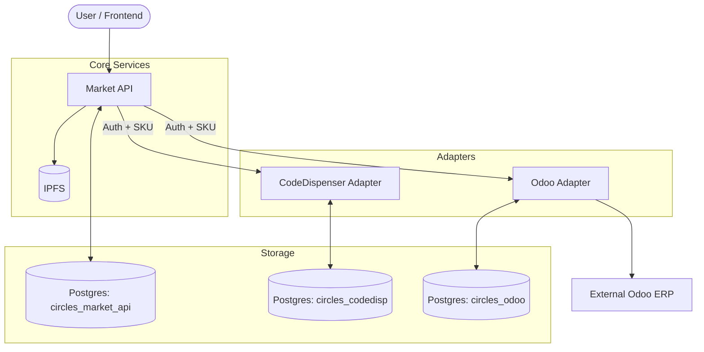

# Architecture & Ownership

This document describes the high-level architecture of Circles.Market and defines the ownership rules for data and configuration.

## System Diagram

## Ownership Rules

To keep the system maintainable and decouple services, we follow these ownership rules:

### 1. Database Provisioning
- **Provisioner (`init-db`):** Owns the creation of databases and users. It is a "one-shot" service that ensures the PostgreSQL instance is ready for the services.
- **Rule:** The provisioner never creates tables or seeds business data.

### 2. Schema Ownership
- **Services:** Each service (Market API, CodeDispenser, Odoo Adapter) owns its own database schema.
- **Rule:** Services are responsible for creating and migrating their own tables on startup. No service should ever touch another service's database.

### 3. Configuration Ownership
- **Admin APIs:** Runtime configuration (auth keys, seller connections, SKU mappings) is owned by the operator via admin APIs.
- **Rule:** Configuration rows are written through the Market API admin proxy endpoints by default (which mint/admin JWTs and proxy to adapters). Services read this configuration at runtime but do not auto-seed it.

## Where is X configured?

| If you want to change... | Go to... |
| :--- | :--- |
| JWT validation domains | `.env` (`MARKET_AUTH_ALLOWED_DOMAINS`) |
| Market -> Adapter auth | `CIRCLES_SERVICE_KEY` shared secret (env) |
| Seller Odoo credentials | `PUT /admin/odoo-connections` (Market API admin proxy) or Odoo admin `/admin/connections` |
| SKU to Odoo product mapping | `POST /admin/odoo-products` (Market API admin proxy) or Odoo admin `/admin/mappings` |
| SKU to Code pool mapping | `POST /admin/code-products` (Market API admin proxy) or CodeDispenser admin `/admin/mappings` |
| Digital codes in a pool | `POST /admin/code-products` (Market API admin proxy) or CodeDispenser admin `/admin/code-pools` + `/admin/code-pools/{poolId}/seed` |
