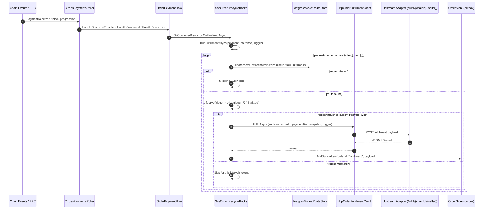
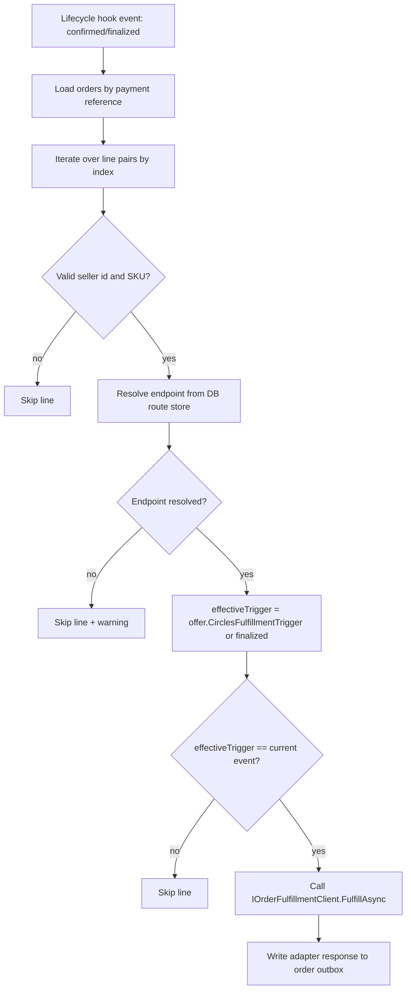
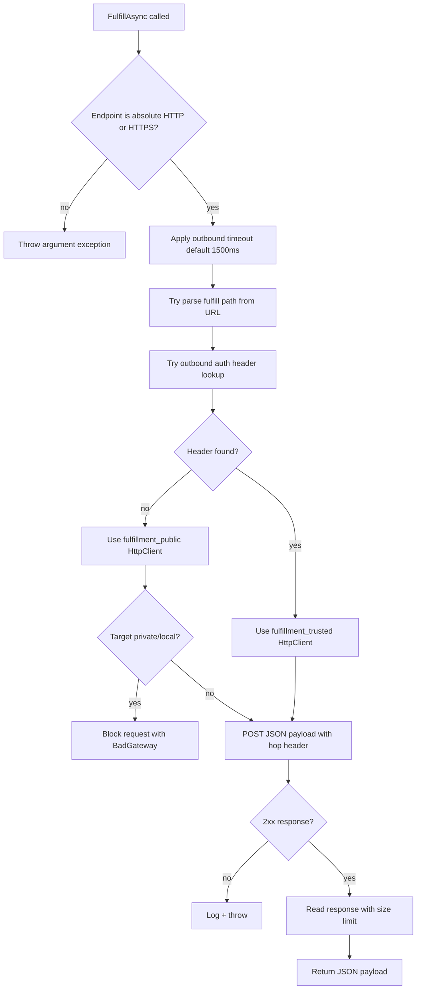
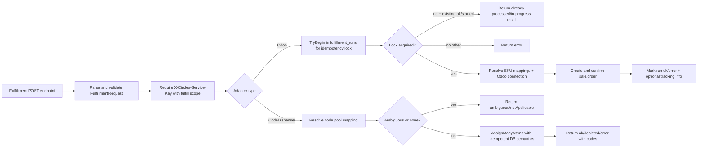

# Fulfillment Logic

This document summarizes how fulfillment currently works across `Circles.Market.Api` and the fulfillment adapters.

## 1) End-to-end fulfillment sequence

---

## 2) Trigger and routing decision logic

**Important:** fulfillment endpoint in offer snapshots is intentionally not trusted; endpoint is resolved from DB at fulfillment time.

---

## 3) Outbound fulfillment client behavior

Payload sent to adapter includes:
- `orderId`
- `paymentReference`
- `buyer`
- `items[]` (`sku`, `quantity`)
- `trigger`

---

## 4) Adapter-level processing

---

## 5) Practical findings and caveats

1. **Default trigger is `finalized`** unless explicitly set to `confirmed` on the offer.
2. **Line iteration is index-based** (`offer[i]` with `item[i]`), bounded by `min(counts)`.
3. **Missing route or trigger mismatch is a soft skip**, not a hard error.
4. **API hook currently performs best-effort execution**; failures are logged and do not stop other lines.
5. **Potential duplicate adapter calls** can happen when multiple lines resolve to same endpoint and trigger (adapter idempotency mitigates this, especially Odoo via `fulfillment_runs`).

---

## 6) Duplicate-call semantics (adapter contract)

For the same idempotency key `(chainId, seller, paymentReference)`:

- If a run is already `started`, adapters must **not** start a second concurrent execution.
- If a run is already `ok`, adapters must **not** execute again.
- In both cases, adapters should return a deterministic replay-style response (`Already in progress` / `Already processed`) instead of re-running fulfillment logic.

This is the behavior frontend and implementor integrations should rely on.

### Error reconciliation policy

Run status transitions are:

- `started` -> `ok` on successful completion
- `started` -> `error` on failed completion

Reconciliation rules:

- `ok`: replay only, never re-execute.
- `started`: replay only, never re-execute by default.
- `error`: retriable; a later call may re-acquire and execute again.

This gives strict duplicate suppression for in-flight/successful runs while still allowing recovery from failed runs.

### Optional stale-started takeover (operator override)

By default, stale `started` runs are **not** taken over.

Operators can opt in to stale-started takeover with:

- Odoo:
  - `ODOO_FULFILLMENT_ALLOW_STARTED_TAKEOVER` (default: `false`)
  - `ODOO_FULFILLMENT_STALE_MINUTES` (default: `10`)
- CodeDispenser:
  - `CODE_FULFILLMENT_ALLOW_STARTED_TAKEOVER` (default: `false`)
  - `CODE_FULFILLMENT_STALE_MINUTES` (default: `10`)

When enabled, a `started` run older than the configured stale window may be re-acquired.

> Operational warning: enabling stale takeover can permit re-execution after long-running or interrupted calls. Keep disabled unless you explicitly want this recovery mode.
